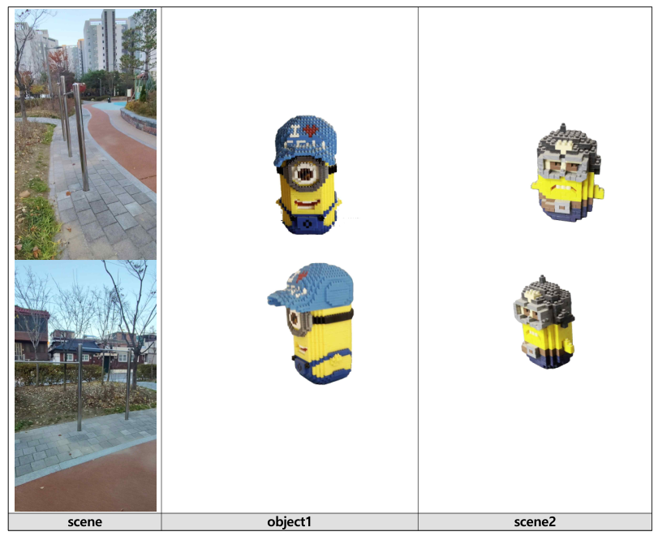
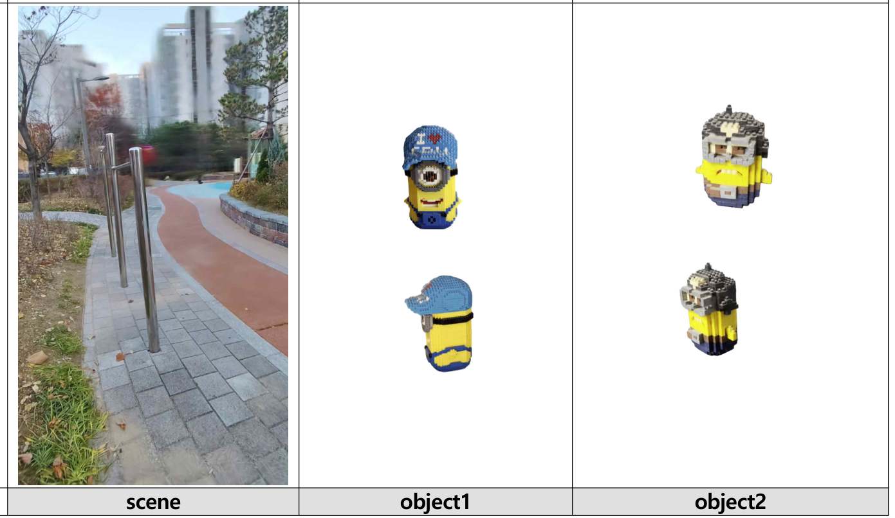
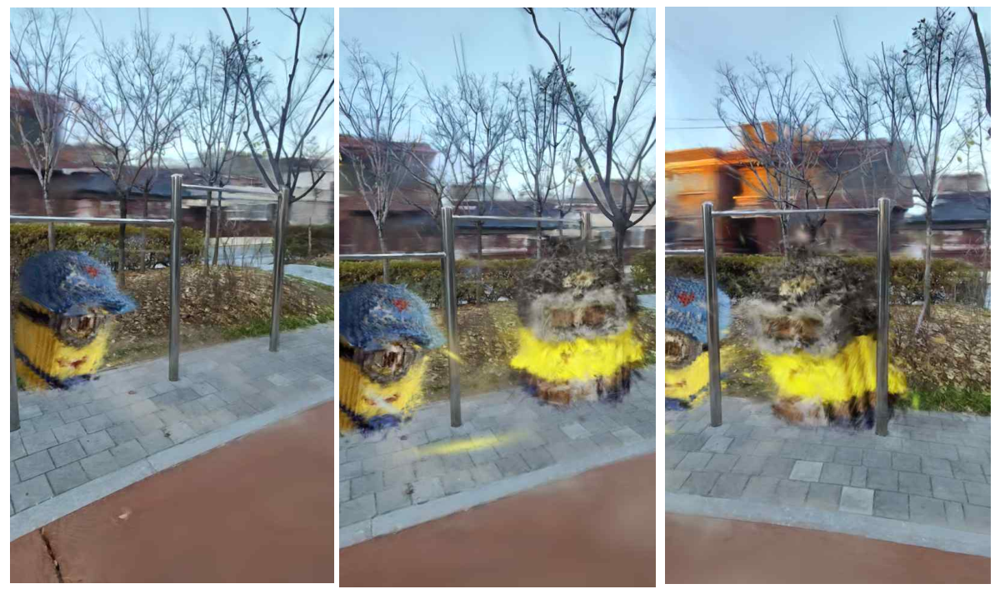

# 3D Gaussian Splatting: Mini-Movie Composition


The final project for *Introduction to Computer Vision*: reconstruct a real outdoor scene and two physical Minions nanoblock figures as separate 3D Gaussian Splatting models, composite them into one scene with scripted transforms, and render a short animated "mini movie."

## Pipeline

1. **Data collection & SfM** — separately record the scene and each object, extract frames, and run COLMAP SfM to get camera poses and a sparse point cloud for each.
2. **3DGS reconstruction** — train a Gaussian Splatting model per scene/object using the [official implementation](https://github.com/graphdeco-inria/gaussian-splatting).
3. **Composition** — merge the scene and object Gaussian models into one representation, with per-object scale/rotation/translation.
4. **Dynamic rendering** — script a camera + object animation as a JSON schedule, render it frame-by-frame, and stitch the frames into a video with FFmpeg.

## Files

| File | Role |
|---|---|
| `sfm.py` | *(inferred — please confirm)* Frame extraction and COLMAP-based SfM for the scene and object footage, including the SAM2-segmented re-run for the objects |
| `compose.py` | `ComposedGaussianModel` — merges the scene and object Gaussian models with per-object scale/rotation/translation transforms; includes the white-background-artifact filter |
| `render_composed.py` | Renders the static composed scene to PNG frames, using the original scene's camera parameters |
| `animate_final_composition.py` | Two-stage animation pipeline — `generate_animate_json` builds a per-frame camera + transform schedule, `render_from_json` renders each frame from it |

`compose.py`, `render_composed.py`, and `animate_final_composition.py` depend on the official 3DGS codebase and must be copied into its top-level folder and run from there — they aren't standalone (see **Run** below).

## Data



| | FPS | Frames |
|---|---|---|
| Scene (playground) | 30 | 771 |
| Object 1 (Minion nanoblock) | 7.5 | 177 |
| Object 2 (Minion nanoblock) | 7.5 | 128 |

Without background removal, the floor and walls were reconstructed along with the objects, and even heavy filtering left the 3DGS reconstruction visibly degraded. Segmenting each object with SAM2 and re-running SfM on the object-only frames fixed this.

## 3DGS reconstruction

Trained with the official implementation. The scene used 12,000 iterations (its much higher frame count made further training too slow); each object used 30,000.

| Target | Iterations | Loss | PSNR |
|---|---|---|---|
| Scene | 7,000 | 0.0376 | 22.8915 |
| Scene | 12,000 | 0.0322 | 23.1485 |
| Object 1 | 7,000 | 0.0054 | 31.3458 |
| Object 1 | 30,000 | 0.0032 | 35.3826 |
| Object 2 | 7,000 | 0.0058 | 30.9239 |
| Object 2 | 30,000 | 0.0045 | 34.4582 |



Objects converge to much higher PSNR (>34 dB) than the scene (~23 dB) — expected, given the scene is larger and more complex but got fewer relative iterations.

## Composition

```bash
python compose.py --scene ../output/scene_3_final \
  --objects ../output/minion_2_gaussian ../output/minion_gaussian \
  --output ../output/composed_minions \
  --remove_pattern
```

`ComposedGaussianModel.add_model()` places each object into the scene with three transforms — logarithmic scaling of position/scale, Euler-angle rotation converted to a quaternion, and rigid translation — then concatenates all Gaussian parameters (`xyz`, `features`, `scaling`, `rotation`, `opacity`) into one representation. SAM2's segmentation left white background artifacts that dominated the composited renders, fixed by adding a filter that suppresses white-colored background pixels.

```bash
python render_composed.py --scene ../output/scene_3_final \
  --composed_ply ../output/composed_minions/composed.ply \
  --output ../output/composed_minions
```



## Dynamic rendering ("mini movie")

**Theme:** Minions' Outdoor Adventure. Object 1 and object 2 each enter, move to a target position, and settle — while the camera moves through the scene.

```bash
python animate_final_composition.py --scene ../output/scene_3_final \
  --object1 ../output/minion_2_gaussian --object2 ../output/minion_gaussian \
  --output ../output/final_animation --json animation_config.json
```

**Stage 1 — `generate_animate_json`**: builds a per-frame schedule of camera index + object transforms.

| Frames | Behavior |
|---|---|
| 0–30 | Scene only, camera 200 → 230 |
| 31–90 | Object 2 appears and moves |
| 91–160 | Camera transition, 230 → 300 |
| 161–220 | Object 1 appears and moves |
| 221–280 | Object scale change (sinusoidal) |
| 281+ | Depth-aware composition, camera 300 → 605, objects fixed |

The video opens from camera index 200 rather than 0 so a playground structure is centered in the first shot. Tuning the per-object transforms surfaced two relationships: moving an object left/right (relative to camera 0) is controlled by z-translation, and pushing an object forward while enlarging it requires gradually increasing x-translation.

**Stage 2 — `render_from_json`**: for each frame, builds a `ComposedGaussianModel` from the scene + object Gaussians with that frame's transforms, renders it from the corresponding camera, and saves it as a PNG.

```bash
ffmpeg -framerate 30 -i ../output/final_animation/frame_%04d.png \
  -c:v libx264 -pix_fmt yuv420p ../output/final_animation/animation.mp4
```

## Run

```bash
# 1. Clone the official 3DGS repo
git clone --recursive https://github.com/graphdeco-inria/gaussian-splatting.git

# 2. Copy compose.py, render_composed.py, and animate_final_composition.py
#    into the cloned gaussian-splatting/ folder, then run from inside it:
python compose.py --scene ../output/scene_3_final --objects ../output/minion_2_gaussian ../output/minion_gaussian --output ../output/composed_minions --remove_pattern
python render_composed.py --scene ../output/scene_3_final --composed_ply ../output/composed_minions/composed.ply --output ../output/composed_minions
python animate_final_composition.py --scene ../output/scene_3_final --object1 ../output/minion_2_gaussian --object2 ../output/minion_gaussian --output ../output/final_animation --json animation_config.json

# 3. Stitch the rendered frames into a video
ffmpeg -framerate 30 -i ../output/final_animation/frame_%04d.png -c:v libx264 -pix_fmt yuv420p ../output/final_animation/animation.mp4
```
