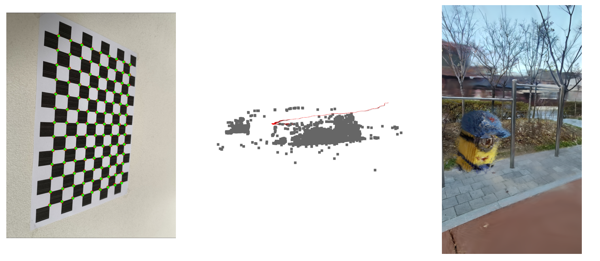

# Introduction to Computer Vision

Coursework projects from *Introduction to Computer Vision* (기초컴퓨터비전이론및응용), covering the 3D vision pipeline from camera calibration to novel-view rendering. The core algorithms are implemented from scratch in Python rather than using off-the-shelf calibration or SfM libraries.

## Projects

| Project | Description |
|---|---|
| [`camera-calibration/`](./camera-calibration) | Zhang's calibration method implemented from scratch — DLT initialization, intrinsic/extrinsic parameter estimation, and Levenberg-Marquardt refinement of radial distortion — validated against OpenCV's built-in calibration. |
| [`SfM/`](./SfM) | An incremental Structure-from-Motion pipeline built from scratch and benchmarked against COLMAP, using a self-collected video dataset shot across 17 locations. |
| [`3DGS/`](./3DGS) | A 3D Gaussian Splatting pipeline that reconstructs a scene from self-shot footage and renders an animated fly-through. |

Each folder has its own README with implementation details and results.

## Course

Korea University, Fall 2025. The course covered image formation, camera calibration, epipolar geometry, depth estimation, SfM, MVS, neural implicit representations, and 3D Gaussian Splatting.
