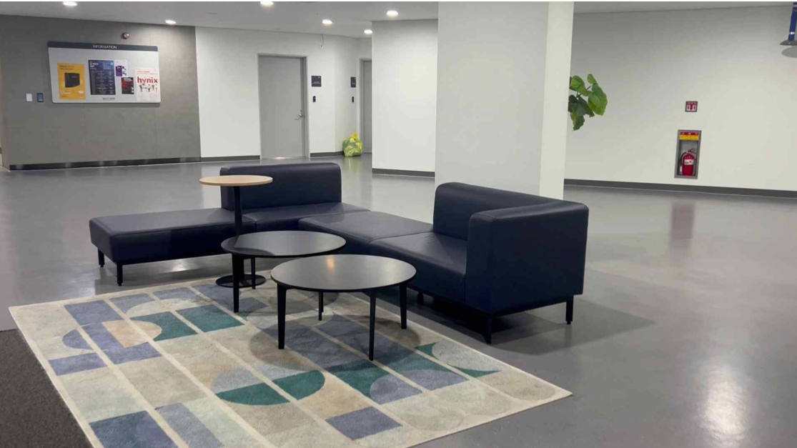
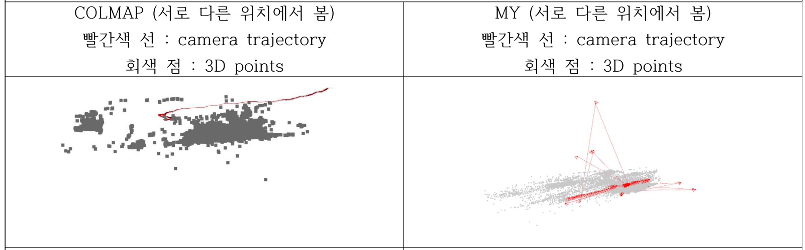

# Structure from Motion (SfM)

An incremental Structure-from-Motion pipeline built from scratch — two-view seeding, PnP-based image registration, incremental triangulation, and global bundle adjustment — benchmarked against COLMAP on the same self-captured video.

## Pipeline

**Initialization**
1. **Two-view seeding** — estimate the fundamental matrix via RANSAC, recover the essential matrix (`E = KᵀFK`, rank-2 enforced via SVD), and decompose it into `[R | t]` with `cv2.recoverPose`. Verify geometrically (inlier count, median parallax, `det(R) = +1`) before accepting.
2. **Seed triangulation** — place the reference camera at `[I | 0]` and the second at `[R | t]`, triangulate the initial 3D points, and filter by cheirality (positive depth) and reprojection error.

**Iteration** (repeated per new frame)
1. **Next-image selection** — pick the unregistered frame with the most 2D–3D correspondences to already-registered cameras, subject to a spatial-spread constraint.
2. **PnP registration** — estimate the new camera's pose with EPnP, prune correspondences by reprojection error and depth using a robust median/MAD score, refine with iterative PnP, then register the camera.
3. **Incremental triangulation** — triangulate new 3D points from 2D–2D matches between the new view and its registered neighbors, filtered by cheirality and reprojection error.
4. **Global bundle adjustment** — jointly refine all camera poses and the shared intrinsic matrix by minimizing Huber-robustified reprojection error (Levenberg-Marquardt).

Feature matching runs SIFT on adjacent frame pairs only, filtered with Lowe's ratio test and cross-checking. The intrinsic matrix starts from a heuristic (`f ≈ 1.2 × max(W, H)`, principal point at image center) and is refined during bundle adjustment.

## Files

| File | Role |
|---|---|
| `frame_extraction.py` | Samples frames from the input video at a fixed FPS |
| `features.py` | SIFT keypoint extraction and adjacent-frame matching (Lowe ratio test + cross-check) |
| `sfm_4.py` | `SfMPipeline` — core state (cameras, tracks, observations) and the initialization/iteration logic |
| `triangulation_custom.py` | Triangulation from `[I\|0]`/`[R\|t]` pairs, with cheirality + reprojection-error filtering |
| `pnp_custom.py` | EPnP-based pose estimation and robust (median/MAD) inlier pruning for new-view registration |
| `global_ba.py` | Global bundle adjustment (Huber loss, Levenberg-Marquardt) over all cameras + intrinsics |
| `reprojection_error.py` | Reprojection error metrics (mean, median, RMSE, percentiles) |
| `colmap_comparison.py` | Runs the COLMAP baseline on the same footage for comparison |
| `colap_parser.py` | Parses COLMAP's output (camera poses, point cloud) for the comparison |
| `vis_open3d.py` | Open3D visualization of the reconstructed point cloud and camera trajectory |
| `visualizaiton.py` | Additional result visualization |
| `config.py` | Pipeline configuration and parameters |
| `utils.py`, `utils_2.py` | Shared helper functions |
| `main_4.py` | Runs the full pipeline end to end |

## Data

Self-shot video of a room (sofa as the main reconstruction target), sampled into frames at a fixed FPS. Matching is restricted to adjacent frame pairs.

## Results

### Quantitative (vs. COLMAP, same footage)

| Metric | COLMAP | My SfM |
|---|---|---|
| # Points | 40,708 | 12,082 |
| Mean error | 0.5697 | 0.6425 |
| Median error | 0.4056 | 0.4384 |
| RMSE | 0.7370 | 0.8651 |
| 90th percentile | 1.2706 | 1.5463 |
| Max error | 3.7411 | **3.2697** |

The error distribution runs slightly higher on average than COLMAP's, but the **max error is lower** — the outlier-removal step below worked. Point count is also lower: matching is restricted to adjacent frames and the view graph is explored linearly, versus COLMAP's global matching graph and next-best-view selection across all frames; a few views also failed PnP registration (too small a baseline, or low-quality 2D–3D correspondences) and were skipped.

### Qualitative

## Debugging outliers

The biggest issue during implementation was extreme reprojection-error outliers — an early version had mean error over 10 with some points exceeding 3000, despite RANSAC. Since RANSAC, PnP, and triangulation are all implemented manually (without OpenCV's internal validation/normalization), robustness was lower than a library implementation. Outliers traced back to three causes:
- Near-parallel or degenerate projection rays during triangulation
- Triangulation attempted with too small a baseline
- PnP occasionally selecting the wrong inlier set

Diagnosing this with mean/median/max error, RMSE, and MAD, then manually removing outliers in post-processing, brought the max error down to COLMAP's level and substantially improved both the mean error and RMSE.

## Possible improvements

| Improvement | Expected effect |
|---|---|
| Next-best-view selection (including non-adjacent frames) | Larger baselines → more stable triangulation |
| Re-select PnP inliers after RANSAC + EPnP + refinement | Prevents incorrect initial pose estimates |
| Check triangulation angle against a threshold before triangulating | Avoids near-zero-baseline triangulation |
| Search neighboring nodes in the matching graph instead of re-seeding after a PnP failure | Fewer skipped views |

## Run

\`\`\`bash
python main_4.py            # My SfM
python colmap_comparison.py # COLMAP baseline
\`\`\`
