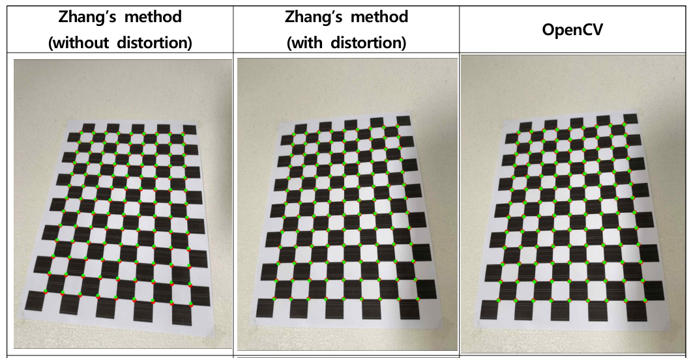
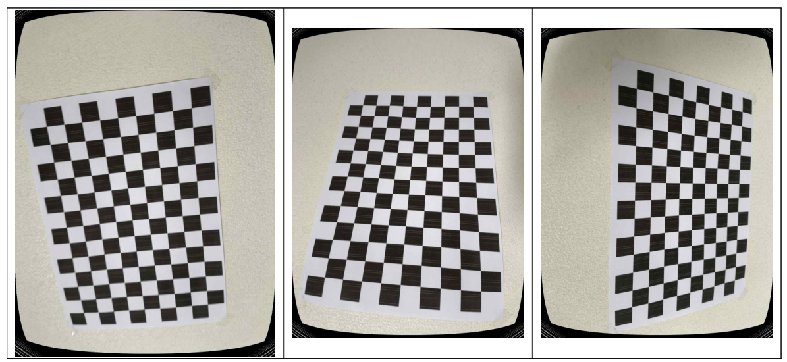

# Camera Calibration



A from-scratch implementation of Zhang's camera calibration method (Z. Zhang, *A Flexible New Technique for Camera Calibration*, IEEE TPAMI), benchmarked against OpenCV's `cv2.calibrateCamera()`.

## Method

1. **Corner detection** — detect and sub-pixel refine checkerboard corners (`cv2.findChessboardCorners` + `cv2.cornerSubPix`).
2. **Homography estimation** — solve each view's homography via normalized DLT (`Ah = 0`, solved with SVD).
3. **Intrinsics** — build the closed-form linear system `Vb = 0` from the homographies and solve for the intrinsic matrix via SVD, with skew fixed to 0.
4. **Extrinsics** — recover `[R | t]` per view from the intrinsics and each homography, projecting the rotation to the nearest valid rotation matrix (SVD) to correct for noise.
5. **Non-linear refinement** — jointly refine intrinsics, extrinsics, and radial distortion (`k1, k2`) with Levenberg-Marquardt, minimizing total reprojection error. Tangential distortion and skew are fixed to 0, per the paper.

OpenCV's `cv2.calibrateCamera()` is run in parallel as a baseline, which jointly optimizes a full 5-parameter distortion model (`k1, k2, p1, p2, k3`).

## Files

| File | Role |
|---|---|
| `board_spec.py` | Checkerboard specification (rows/cols/square size) and 3D board-coordinate generation |
| `corner_detection.py` | Corner detection and sub-pixel refinement |
| `zhang_calibrator.py` | Zhang's method — DLT homography, closed-form intrinsics, extrinsics |
| `zhang_refinement.py` | Non-linear (Levenberg-Marquardt) refinement of intrinsics + distortion |
| `opencv_calibration.py` | OpenCV baseline (`cv2.calibrateCamera()`) |
| `result.py` | Reprojection error metrics (RMS, MeanL2) and result formatting |
| `visualization.py` | Observed-vs-reprojected and undistorted-image visualization |
| `main.py` | Runs the full pipeline end to end |

## Setup

- 25 checkerboard images (1080×1440)
- Board: 13×9 (rows×cols), 20 mm squares

## Results

### Reprojection error

| Method | RMS (px) | MeanL2 (px) |
|---|---|---|
| Zhang, no distortion | 2.609 | 2.067 |
| Zhang, with distortion | 0.943 | 0.808 |
| OpenCV | 0.925 | 0.792 |

Adding the distortion term cuts RMS by **63.9%** and MeanL2 by **60.9%** over the pure-homography baseline. With distortion modeled, the from-scratch implementation lands within **~2%** of OpenCV.

### Distortion coefficients

| Method | k1 | k2 | p1 | p2 | k3 |
|---|---|---|---|---|---|
| Zhang | 0.1534 | -0.3817 | — | — | — |
| OpenCV | 0.1495 | -0.3548 | -0.0035 | 0.0009 | -0.0284 |

### Intrinsics

| | fx | fy | cx | cy |
|---|---|---|---|---|
| Zhang, no distortion | 1102.37 | 1099.41 | 543.05 | 721.78 |
| Zhang, with distortion | 1074.33 | 1071.45 | 540.07 | 723.70 |
| OpenCV | 1074.22 | 1071.61 | 541.89 | 715.57 |

### Why the small remaining gap?

This implementation estimates radial distortion only (`k1, k2`) and fixes tangential distortion and skew to 0, following the paper. OpenCV's default model adds tangential terms and a third radial coefficient, which likely accounts for its marginally lower edge residuals — along with OpenCV's more mature bundle-adjustment optimizer (analytic Jacobians, parameter scaling).

## Visualizations



## Run

```bash
python main.py
```
